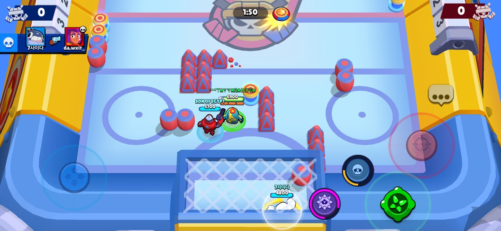
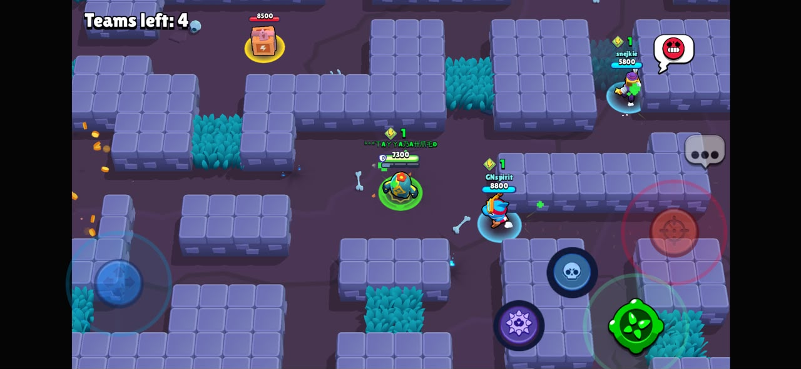
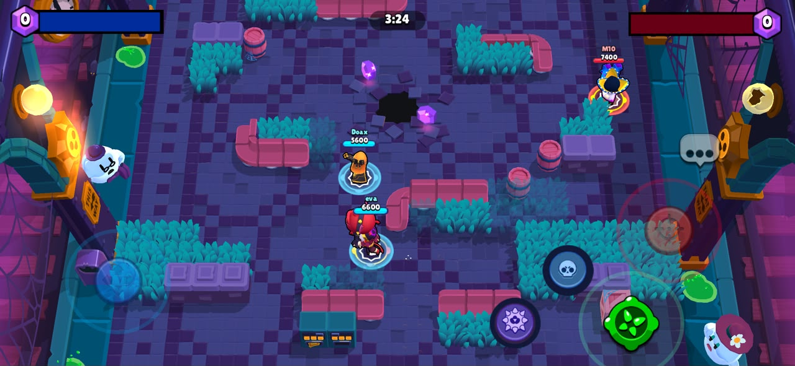
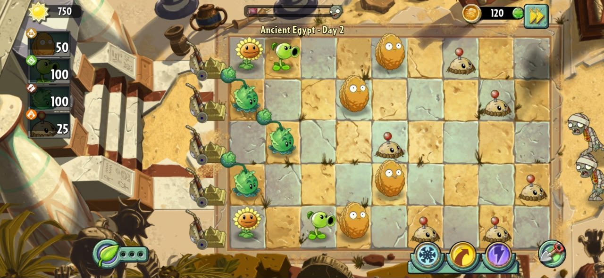
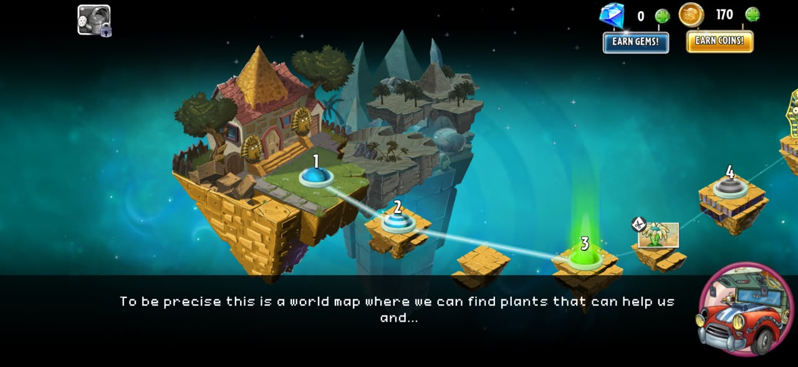
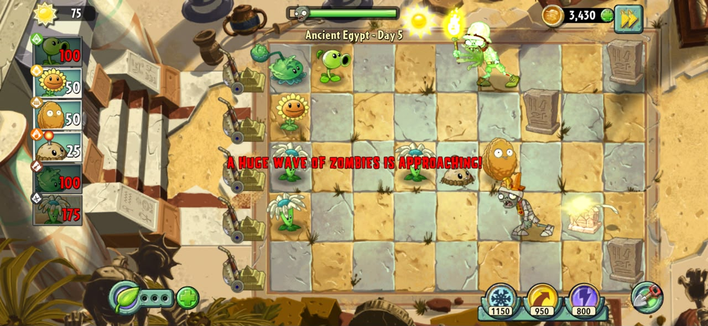
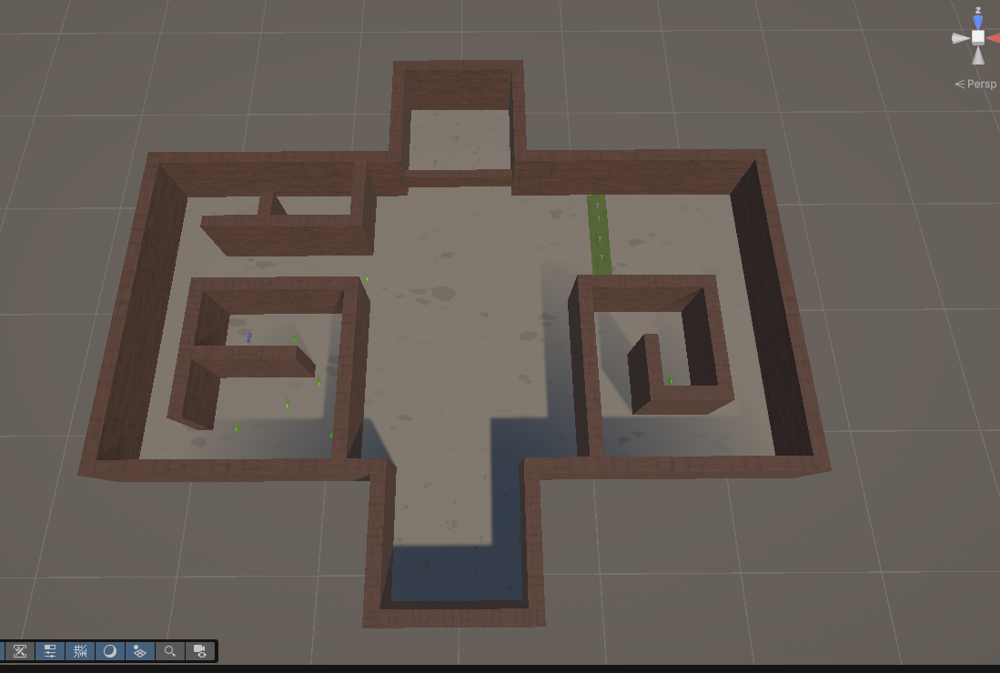
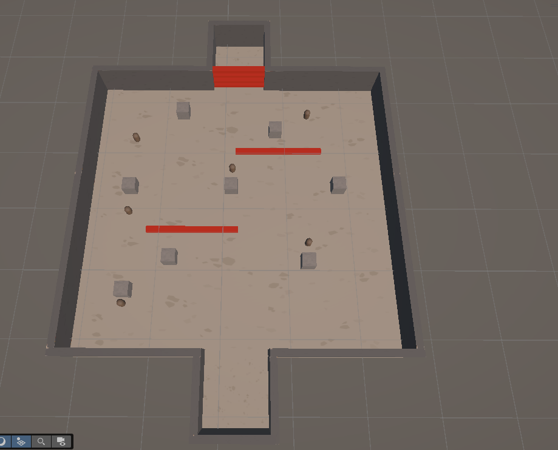
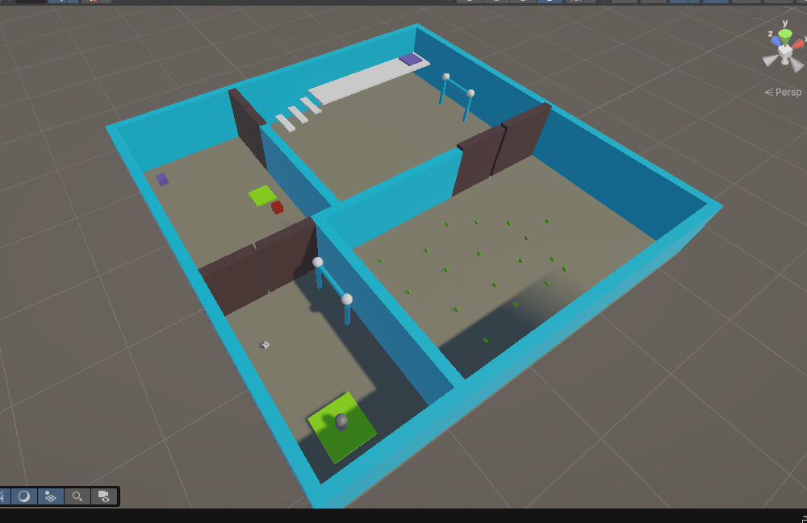
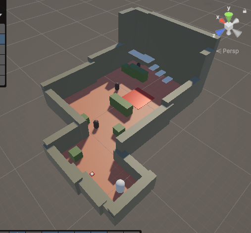

# CS464 Assignment 01 · TAYYAB AHMED MINHAS · BSCS25031

## Game 1 · Brawl Stars

- **Store link:** https://play.google.com/store/apps/details?id=com.supercell.brawlstars
- **Genre:** Multiplayer Action / Hero Shooter
- **I played:** I've played this game before for more than 2 years. For the sake of this assignment, I played it for 40 more minutes.

1. [M1, M2, M3] · Shows active combat where Brawlers manage limited attack ammunition, deal damage to charge their Super, and use their Brawler's unique attack range and abilities.

2. [M1, M2, M3] · Shows team combat and positioning around walls and bushes, where players manage ammunition, charge their Super through combat, and use their Brawler's abilities according to the map layout.

3. [M1, M2, M3, M7] · Shows an active team fight where the player manages attacks and Super charge while also having access to a Gadget as an additional ability during combat.

| # | Mechanic | Dynamic | Aesthetic | Bartle type |
|---|---|---|---|---|
| M1 | Each Brawler has limited attack ammunition that automatically reloads over time. | Players conserve their shots and may retreat while reloading instead of continuously attacking. | **Challenge:** Managing ammunition and timing attacks makes combat more skill-based. | Killer |
| M2 | Dealing damage charges a Brawler's Super [ Super is basically a brawle's ultimate power], which provides a more powerful special ability. | Players look for opportunities to deal damage to charge their Super and save it for important fights or objectives. | **Challenge:** Players must decide when using their powerful Super will have the greatest impact. | Killer |
| M3 | Different Brawlers have different attacks, ranges, health values and abilities. | Players change their positioning and fighting style depending on the Brawler they are using and the opponents they face. | **Expression:** Different Brawlers allow players to choose and develop a preferred playstyle. | Killer |
| M4 | In Gem Grab, teams collect Gems from the center and must hold enough of them [ Atleast 10 ] until the winning countdown finishes. | Teams compete for control of the center [ Because gems are spawned in the center of the map ] and protect teammates carrying many Gems instead of only chasing eliminations. | **Fellowship:** Players cooperate and protect one another to complete the team objective. | Socializer |
| M5 | In Showdown, eliminated players are removed and the objective is to be the last Brawler or team remaining. | Players avoid unfavorable fights, choose engagements carefully and sometimes wait for opponents to weaken each other. | **Challenge:** Survival requires careful positioning, combat skill and risk assessment. | Killer |
| M6 | Power Cubes collected in Showdown increase a Brawler's health and attack damage for that match. | Players compete for Power Cubes and decide whether gaining additional power is worth risking an encounter with another player. | **Challenge:** Collecting more power creates a risk-versus-reward decision. | Achiever |
| M7 | Gadgets give Brawlers additional abilities that can be activated during battle and operate with cooldowns. | Players save their Gadget for useful situations and time its activation instead of using it whenever it becomes available. | **Challenge:** Correctly timing an additional ability can change the outcome of a fight. | Killer |

**Aesthetic profile:** Brawl Stars primarily emphasizes **Challenge, Fellowship and Expression**. Challenge comes from managing ammunition, timing abilities, surviving fights and making risk-versus-reward decisions (M1, M2, M5, M6 and M7). Fellowship appears strongly in team-based modes such as Gem Grab, Brawl Ball where teammates cooperate to control objectives and protect one another (M4). Expression comes from the different Brawlers and playstyles available to the player (M3).

**Player types**
- **Primary: Killer (Acting × Players),** because much of the core gameplay involves directly affecting opposing players through attacks, Supers and eliminations (M1, M2, M3, M5 and M7).
- **Secondary: Achiever (Acting × World),** because players also work with the game's systems to become stronger and improve their performance, such as collecting Power Cubes and mastering different gameplay mechanics (M6).

## Game 2 · Plants vs. Zombies 2

- **Store link:** https://play.google.com/store/apps/details?id=com.ea.game.pvz2_row
- **Genre:** Tower Defense / Strategy
- **I played:** I've played this game before casually. For the sake of this assignment, I played it for 40 more minutes.

1. [M1, M2, M3, M4] · Shows an active level where sun is managed to place different plants across lanes, including Sunflowers for resource production and defensive plants with different roles.

2. [M7] · Shows the world map and level progression, where the player selects the next stage to continue progressing through the game.

3. [M1, M2, M4, M5] · Shows an active battle where different plants are positioned across lanes to defend against approaching zombies with different properties and threats.

| # | Mechanic | Dynamic | Aesthetic | Bartle type |
|---|---|---|---|---|
| M1 | Sun is a resource used to place plants, and different plants require different amounts of sun. | Players decide whether to spend sun immediately on defense or save it for more expensive plants. | **Challenge:** Limited resources force players to prioritize which plants they need and when to place them. | Achiever |
| M2 | Plants are placed on tiles across different lanes while zombies advance through those lanes toward the player's house. | Players concentrate their defenses in lanes according to where zombies are approaching. | **Challenge:** Correct positioning is necessary to prevent zombies from breaking through the player's defenses. | Achiever |
| M3 | Sunflowers periodically produce additional sun after being planted. | Players invest in Sunflowers early to build their sun economy while balancing the need for immediate defensive plants. | **Challenge:** Players balance short-term survival against building a stronger resource economy for later waves. | Achiever |
| M4 | Different plants perform different roles, such as producing sun, attacking zombies, blocking them or dealing damage to groups. | Players combine plants with complementary abilities rather than relying on only one type of plant. | **Expression:** Different plant combinations allow players to create their own defensive strategies. | Achiever |
| M5 | Different zombie types have different abilities and properties that can make certain defenses more or less effective. | Players identify dangerous zombie types and adapt their plant selection and placement to counter them. | **Discovery:** Encountering new zombies encourages players to learn how they behave and discover effective counters. | Explorer |
| M6 | Plant Food can be collected and used on a plant to temporarily activate a powerful special effect. | Players often save Plant Food for large waves or emergencies and choose which plant will benefit most from it. | **Challenge:** A limited powerful resource makes choosing the correct plant and timing important. | Achiever |
| M7 | Before many levels, players select a limited set of plants to use during the battle. | Players consider the expected zombies and choose a combination of plants that they believe can handle the level. | **Expression:** Plant selection lets players develop different strategies and approaches to the same challenge. | Achiever |

**Aesthetic profile:** Plants vs. Zombies 2 primarily emphasizes **Challenge, Discovery and Expression**. Challenge comes from managing sun, positioning plants and deciding when to use limited resources such as Plant Food (M1, M2, M3 and M6). Discovery comes from encountering different zombies and learning how their abilities interact with the player's defenses (M5). Expression comes from selecting and combining plants to create different defensive strategies (M4 and M7).

**Player types**
- **Primary: Achiever (Acting × World),** because players manipulate the game's systems by managing resources, placing plants and building defenses to overcome each level (M1, M2, M3, M4, M6 and M7).
- **Secondary: Explorer (Interacting × World),** because players encounter different zombie types and learn their behavior, strengths and counters as they progress (M5).

## Level blockouts

| Level | Screenshot | Its idea | Wayfinding tool |
|---|---|---|---|
| Level01 |  | The Idea here is you have to find the key to open the door to the goal. | Wayfinding tools is basically look for coins, followings coins lead to finding key to the door |
| Level02 |  | The idea here is a small shooting range for practice, kill all the moving targets within a given time otherwise killed enemies respawn. Killing the enemies within given time leads to obstacles being removed so now the player can run to the goal| Way finding mechanism is you're given a gun upon start of the round so you'd know you have to kill the moving targets, later a text box would also appear explaining killing enemies in given time removed obstacles and opens door to goal.|
| Level03 |  | The Idea here is to complete small puzzles to complete 2 doorway area through goaling a football, pressing buttons to open door and collecting coins to complete the level| The key indicator are pretty straight forward everyone knows there is a ball and a goal so they would naturally try to goal this woudl open the door then there is combination of small tasks that we usually do forcing player to use their brain, it's something that is copied from mini-games like human fall flat or fall guyz. |
| Level04 |  | The idea here is a small spike plant, basically something you do in csgo or valorant. You pick a spike and plant it in a site, then you defend it. | Wayfinding here is subjective, not a clear goal by just looking at the game, you'd be prompted to do stuff like a tutorial through captions this would be done in coding part of the game. |
| Level05 |  | | |